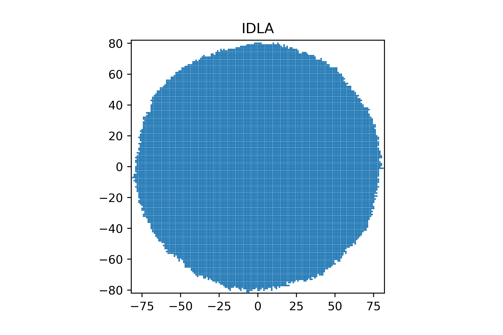
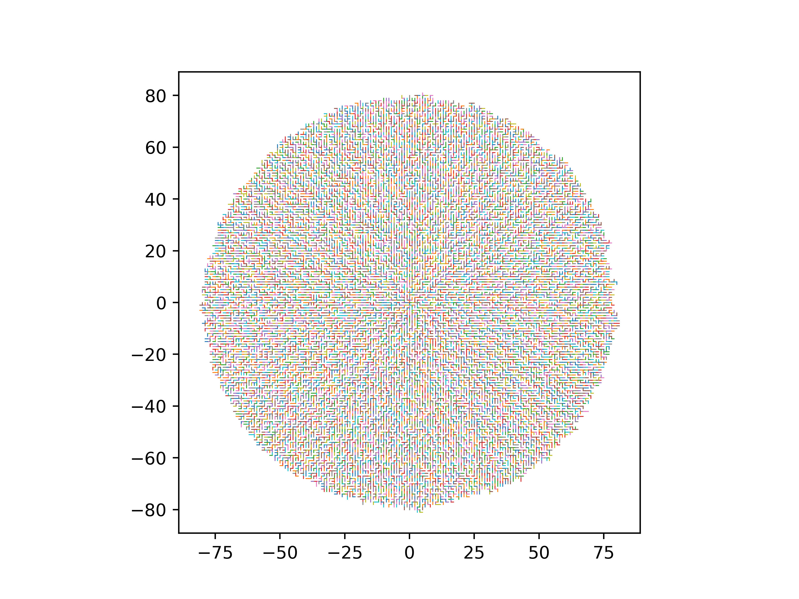
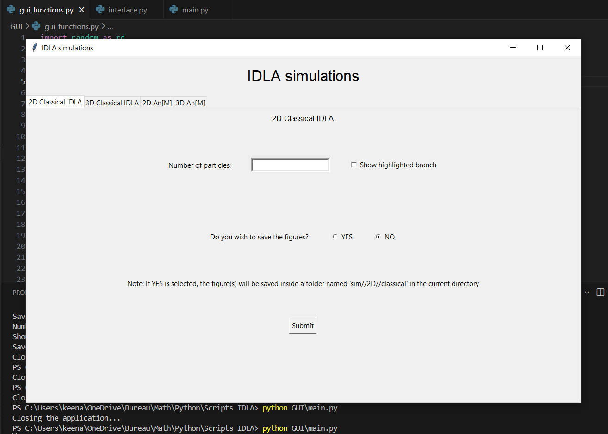
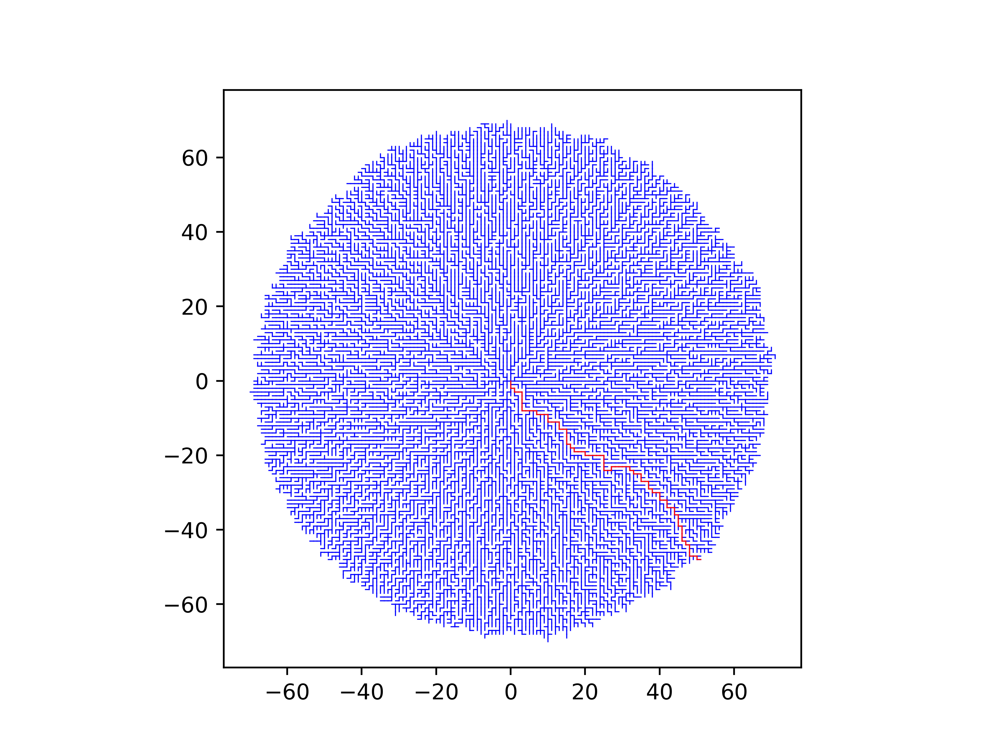

# About
## The standard IDLA model
The following file contains a Python GUI for running standard 2D and 3D IDLA. The IDLA model (Internal Diffusion Limited Aggregation) is a random growth model on $\mathbb{Z}^d$, which creates 
random aggregates according to a specific rule.
We will recursively build a family of aggregates $A(n)$ as follows:
1. For $n=0,\ A(0)=\emptyset$
2. Let $n\geq 1$. Given $A(n-1)$ and $S$ a simple symmetric random walk on $\mathbb{Z}^d$ starting from $0$, we define
			$A(n)=A(n-1)\cup \{S(\tau_{n-1})\}$, where $\tau_{n-1}=\inf\\{t\geq 0,\ S(t)\notin A(n-1)\\}$

In other words, $A(n)$ is obtained by taking $A(n-1)$ and adding the first site that the random walk $S$ visits outside of $A(n-1)$.

For example, here is a simulation with 20000 particles:


## The IDLA tree

Behind the IDLA aggregate hides an IDLA tree. This tree is constructed in a recursive manner as well. We build our tree $T(n)=(V_n,\ E_n)$ as follows:
1. For $n=1,\ V_1=0$ and $E_1=\emptyset$.
2. Let $n\geq 2$. Given $T(n-1)$ and $S$ a simple symmetric random walk on $\mathbb{Z}^d$ starting from $0$, we define just as above $V_n=V_{n-1}\cup \{S(\tau_n)\}$ and
$E_n=E_{n-1}\cup \\{S(\tau_{n-1}-1),S(\tau_{n-1})\\}$, with $\tau_{n-1}=\inf\\{t\geq 0,\ S(t)\notin V_{n-1}\\}$.

Essentially, the vertices of our tree at some step $n$ are are the same as the standard IDLA aggregate A(n), while the edges are obtained by taking the edge through which the random walk exits the aggregate $A(n-1)$.

Here is a simulation of this tree using 20000 particles (the colors of the edges has no particular significance).

The same simulation using 1000 particles in 3D:
<p align="center">
	
</p>

### Using the GUI
The GUI folder contains Python code capable of simulating various IDLA models. Begin by copying the contents of the folder named 'GUI' to your machine, and run ```GUI/main.py``` in your terminal.
The following window should pop up :



At the moment, you can choose between 4 different models: the classical IDLA model in 2D and 3D, and the multisource IDLA model in 2D and 3D.
For the classical models, the GUI returns images of the aggregate and its associated tree, with the option of highlighting the last plotted branch. 
The user also has the option to save the figures.

For the multisource model, the user is asked to provide both the number of particles sent per site $n$ and the desired value of $M$ to plot the aggregate $A_n[M]$.


<!-- In order to simulate the IDLA tree in dimension 2, run the code and enter the following into the console. Remember to specify how many particles you wish to send as the main argument of `idla()`.

```python
A=idla(%number of particles to send%)[1] #store edges into variable A
for i in range(len(A)):
    xline=[A[i][0][0],A[i][1][0]] 
    yline=[A[i][0][1],A[i][1][1]]
    plt.plot(xline,yline,linewidth=2) #play with linewidth to get prettier graphics
    plt.axis('square')
plt.show()
```

Similarly for dimension 3:

```python
A=idla3(%number of particles to send%)[1] #store edges into variable A
ax=plt.axes(projection="3d")
ax.set_box_aspect([1,1,1])
for i in range(len(A)):
    xline=[A[i][0][0],A[i][1][0]]
    yline=[A[i][0][1],A[i][1][1]]
    zline=[A[i][0][2],A[i][1][2]]
    ax.plot(xline,yline,zline,linewidth=2) #play with linewidth to get prettier graphics
plt.axis('off')
plt.show()
``` -->
## Questions around the model

This tree is difficult to study due to the strong dependency between all particles in the IDLA model as well as its radial aspect. One of the main interesting questions about this tree is the straightness of its branches. 
Looking at various simulations, these branches seem relatively straight, but this remains to be proven. 
The user can play around by checking the 'Show highlighted branch' on the 2D and 3D classical IDLA tabs. Note that this may not be easily visible in 3D.

<!-- This is available in the 2-dimensional setting as well as the 3-dimensional setting, and can be obtained by running the following functions in the console:
```python
branchplot(n)
branchplot3d(n)
```
In both functions, $n$ is the number of particles sent from the origin. -->

As an example, a simulation with 20000 particles gives something like


